# Kitaev's toric code

This repository contains an implementation of the Kitaev toric code in qiskit. While the implementation may not be state of the art in its efficiency or optimal in any technical sense, the "down to earth" python/qiskit implementation may prove to be useful for educational purposes. 

## Introduction

Kitaev's toric code is a quantum error correction code, modelled on a $k \times k$ toric lattice (i.e. with periodic boundary), using $2 k^{2}$ physical qubits to encode $2$ logical qubits. In other words, the Kitaev toric code is a $[[2 k^{2} , 2, k]]$ stabilizer code.

A novel feature of the toric code is that the stabilizer elements are defined with respect the spatial arrangement of qubits situated on a $k \times k$ toric lattice. For example, the below image is a $3 \times 3$ toric lattice: 

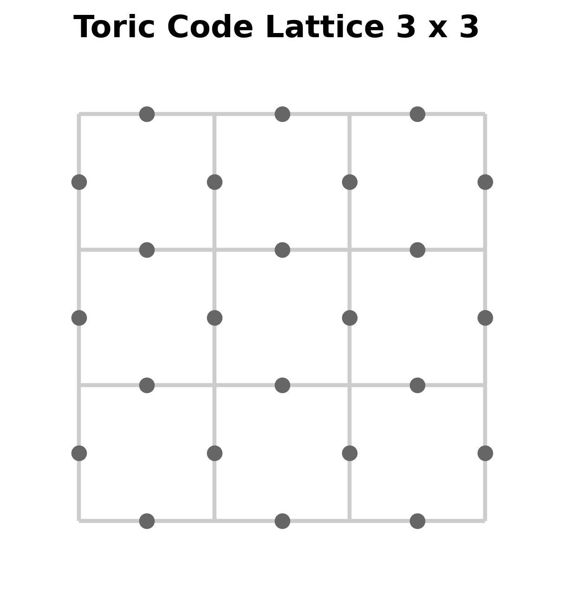

With respect to this lattice, the physical qubits are placed where the grey dots mark the edges. As the lattice represents a torus and has periodic boundary, the qubits on top and bottom rows are identified, as are the qubits on the left and right outer vertical columns. 
Note that with this arrangement, we have a total of $2 \cdot 3^{2} = 18$ (physical) qubits.  

The stabilizer group for the code is generated by certain operators associated to certain configurations of qubits on the lattice. These configurations are given by <em>stars</em> and <em>plaquettes</em>, as depicted below:

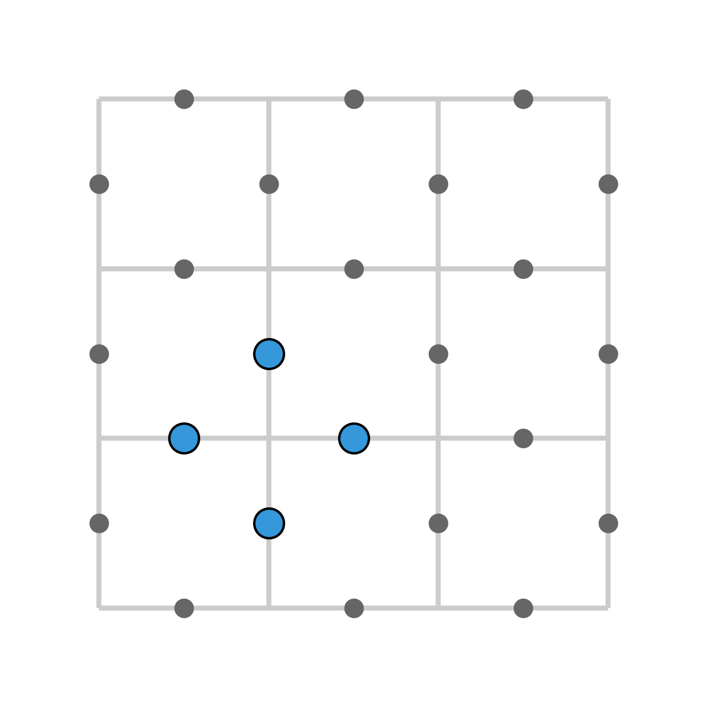
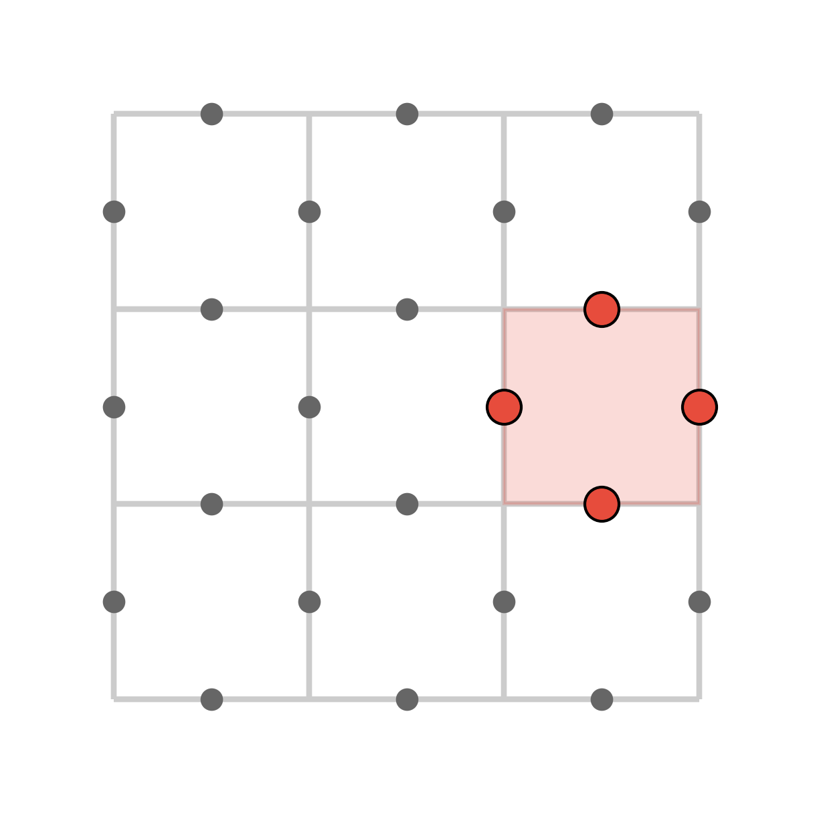

That is, stars are associated to vertices of the lattice, and are given by the respective collections of $4$ qubits on the edges which make up a "star" of a vertex. Plaquettes are associated to the square cells of the lattice, and are given by the the $4$ qubits along the boundary of such a square cell. 

To each star, we associate a unitary given by applying an $X$-gate to each physical qubit in the star. 
To each plaquette, we associate a unitary given by applying a $Z$-gate to each physical qubit in the plaquette. We may refer to these as "star operators" and "plaquette operators".

Then, the toric code is defined to be the stabilizer code generated by star and plaquette operators for each star and plaquette of a fixed toric lattice. One may easily verify that this indeed defines a stabilizer code -- in fact, it is a CSS code. 

Note that while there are $2 k^{2}$ physical qubits, there will be $2 \cdot (k^{2} - 1 )$ minimal  stabilizer generators (corresponding to $k^{2}$ many stars and plaquettes respectively, and accounting for a single relation among the star operators and a single relation among the plaquette operators). Thus, the toric code encodes $2k ^{2}  -   2 (k^{2} - 1) = 2$ logical qubits which we may write as $| x_{0} x_{1} \rangle_{L}$.

## Some details on the implementation

Apart from qiskit, [the main code](KitaevToricCode.py) uses [NetworkX](https://networkx.org/), a package which supplies useful implementations of graphs and networks in python. In particular, NetworkX has an implementation of the "blossom algorithm" which generates minimal weight perfect matchings of a graph with an even number of nodes. This is important for the decoding step of the toric code.

The main body of code is contained in the file [KitaevToricCode.py](KitaevToricCode.py). It contains a python/qiskit function that takes the following inputs: 

1. A pair of booleans $(x_{0}, x_{1}) \in \mathbb{F}^{n}_2$
2. An integer $k$ 
3. An error probability, $p$

and outputs a quantum circuit that does the following:

1. Prepares the logical state $| x_0 x_1 \rangle_L$ with respect to the toric code of size $k$ (i.e. on $2k^{2}$ physical data qubits)
2. Runs it through a random Pauli error channel with error rate $p$
3. Applies appropriate syndrome measurement procedures, along with corresponding syndrome decoding procedures if necessary
4. Measures the data qubits with respect to the appropriate logical $Z$-operators

Note that in the end, we measure the data qubits with respect to the logical $Z$-operators, and not
with respect to the standard computational basis (i.e. with respect to physical Pauli $Z$-operators). 

The idea here is that the $4$ logical basis states $|00\rangle_L$, $|01\rangle_L$, $|10\rangle_L$ and
$|11\rangle_L$ are not necessarily eigenvectors with respect to physical Pauli Z operators, but they are instead eigenvectors with respect to logical $Z$-operators with corresponding eigenvalue measurements:

 Logical State   | $(Z_0)_L$ | $(Z_1)_L$
 --------        | -------   |   ------- 
 $\|00 \rangle_L$  | $1$       | $1$               
 $\|01 \rangle_L$  | $1$       | $-1$              
 $\|10 \rangle_L$  | $-1$      | $1$              
 $\|11 \rangle_L$  | $-1$      | $-1$              

Thus, assuming that the "recovery process" of the error correction procedure leaves us with a logical state in the end, we may use $2$ ancilla qubits corresponding to $(Z_0)_L$ and $(Z_1)_L$, 
whose states will be determined and distinguished by the different configurations of eigenvalues we may have (as described by the above table). By measuring these ancilla qubits, we may recover (with some probability) the appropriate logical state as prepared in the beginning, even after the data qubits have been passed through a random Pauli channel.

## Encoding logical states in the toric code

As the star and plaquette operators are involutions and commute, they are simutaneously diagonalizable with eigenvalues $+1$ and $-1$. The logical $0$ state $| 0 \rangle_L$ can be prepared by projecting the $2k^{2}$ qubit $0$ state $| 0 0 0 \cdots 0 \rangle$ onto the simutaneous $+1$-eigenspace for each star and plaquette operator associated to the $k \times k$ lattice.

Following an idea from [pennylane.ai/qml/demos/tutorial_toric_code](https://pennylane.ai/qml/demos/tutorial_toric_code), we may prepare the appropriate logical zero (or  "ground state") by applying, for each star and plaquette, a circuit that prepares a "generalized GHZ state" among the qubits in the star or plaquette. 

For example, if we label the qubits on the star depicted below in a counterclock wise fashion: $q_0$, $q_1$, $q_2$, $q_3$   

then the GHZ state for this star is given by 

$$
q_0 \otimes q_1 \otimes  q_3 \otimes  q_4  = \frac{1}{\sqrt{2}} \left( | 00 0 0 \rangle + | 1 1 1 1 \rangle \right)$$
$$

It is clear that this state is fixed by the star operator (which recall is given by applying $X$-gates to the group of qubits given by the star). Furthermore, it is also invariant under applying the $Z$-gate to this state.  

To prepare the logical $0$ state $| 0 \rangle_L$, we start with the initial state $| 0 0 0 \cdots 0 \rangle$, and then prepare a superposition of these GHZ states for each star in the lattice.

Once we have our logical $0$ state, we can produce logical states $|01 \rangle_L$ and $|10 \rangle_L$ by defining logical operators $(X_0)_L$ and  $(X_1)_L$ , which give us "logical bit flip" operators. These will map $|00\rangle_L \mapsto |01 \rangle_L$ and $|00\rangle_L \mapsto |10 \rangle_L$ respectively.

## Logical states and the topology of the torus

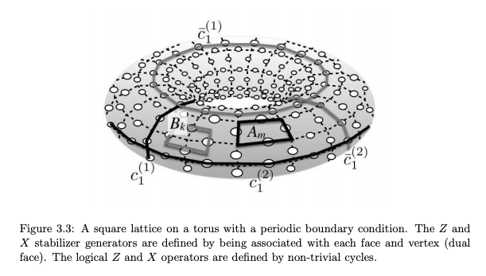

It is easy to see that, starting from the logical $0$ state $|0\rangle_{L}$, applying a (physical) $X$-gate (i.e. a bit-flip) to a qubit on a plaquette produces a state that is a $-1$ eigenvalue for the corresponding plaquette operator. Indeed, this is true because $X$ and $Z$ gates anti-commute. So, as a plaquette operator is defined by applying $Z$-gates around a plaquette $P$, we get:

$$
 ( \prod_{q \in P } Z_{q} ) X_{q^{\ast}} | 0 \rangle_{L} =   - X_{q^{\ast}} ( \prod_{q \in P } Z_{q} ) | 0 \rangle_{L} = -X_{q^{\ast}} | 0 \rangle_{L}
$$

Note that we use the fact that the logical $0$ state $|0\rangle_L$ is a $+1$-eigenvector for the plaquette operator $\prod_{q \in P } Z_{q}$ given by applying the $Z$-gate around plaquette. In the above, $q^{\ast}$ denotes one of the qubits around the given plaquette $P$, so that $X_{q^{\ast}}$ denotes the $X$-gate targeting the qubit $q^{\ast}$. 

By the nature of how the plaquettes are arranged on the lattice, it is easy to see that any qubit $q^{\ast} \in P$ belongs to exactly two plaquettes $P$, $P'$. Thus, the state $X_{q^{\ast}} | 0 \rangle_L$ will be an $-1$-eigenvector for exactly $2$ plaquette operators, and will be a $+1$-eigenvector for all the other plaquette operators. Below is an illustration of two neighbouring plaquettes, sharing exactly one common qubit. The result of this is that the state $X_{q^{*}} | 0 \rangle_L$ will be a $-1$-eigenvalue for the two plaquettes operators associated to the two plaquettes that make up the combined area. Furthermore, note that the composition of the two neighbouring plaquette operators is equal to applying $Z$-gates around the boundary of the combined larger plaquette. 

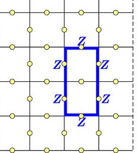

This property is the essence of how one can detect "bit flips errors" on the logical $0$ state $|0 \rangle_{L}$. For example, if a *single* bit flip error occured after preparing the logical $0$ state, then it will be detected by the presence of exactly two $-1$-eigenvalue measurements associated to neighbouring plaquette operators. More generally, isolated bit flip errors can be detected if there are groups of neighbouring $-1$-eigenvalue measurements associated to pairs of neighbouring plaquette operators.

Now suppose that we had a path of  bit flip errors, traversing through adjacent plaquettes. Then, it is easy to see that each plaquette on the path will have an even number bit flipped qubits around their respective boundaries, except for possibly the starting plaquette of the path and the ending plaquette of the path. In other words, $-1$ eigenvalue measurements among plaquette operators can be "pushed out" along a path of bit flips, and the total number of plaquettes operators with $-1$-eigenvalue measurements will always be an even number.  

However, note that if these bit flip paths form a complete loop (which may happen if a bit flip path reaches the periodic boundary of the lattice), then every plaquette in the path will have an even number of $-1$ eigenvector qubits around their boundaries. As a result, none of the plaquette operators will measure any $-1$ eigenvalues and so finding $-1$ eigenvalue measurements among plaquette operators will no longer be sufficient for "detecting bit flip errors".   

There are two cases:

1. The loop is contractible. In this case, we can see that a sequence of $X$-gates applied to each qubit forming a contractible loop actually results in a unitary transformation generated by the star operators (which are included as generators of the toric code). In short, the combination of $X$-gates ends up being an element of the stabilizer group for the code. Thus, no error has actually occured and logical states are unaffected.

2. The loop is not contractible and homologous to a path that goes straight across the lattice horizontally (forming a loop), or straight across the lattice vertically. In this case, the accumulation of bit flip errors is not detectable by eigenvalue measurements among plaquette operators, and resulting state is a logical state. Thus, the accumulation of bit flip errors in this scenario results in a *logical error*. 

By the topology of the torus, there are exactly two homology classes of non-contractible loops. They can be represented by a loop that goes around the "hole" of the torus, and a loop that goes around the "tube"  of the torus. On the lattice representation of the torus, these correspond to paths that go straight across the lattice horizontally or vertically.

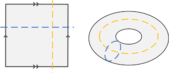

Thus, the logical operators $(X_0)_L$ and $(X_1)_L$ are defined by applying $X$-gates to every qubit along these two horizontal and vertical paths (respectively) across the lattice -- and the logical operators $(Z_0)_L$ and $(Z_1)_L$ are defined by applying $Z$-gates to every qubit along these two horizontal and vertical paths (respectively) across the lattice.

Note that the above has been focusing on bit flip errors. Phase flip errors ($Z$-errors) may be analyzed in a symmetric way where we consider applying $Z$ gates to qubits on the lattice and we use star operators to check for $-1$ eigenvalue measurements. 

## Syndrome measurements and decoding procedures

In light of the above discussion, syndrome measurements and decoding procedures is of course based on keeping track of the plaquettes and stars that result in a $-1$ eigenvalue measurement when measuring the data qubits. 

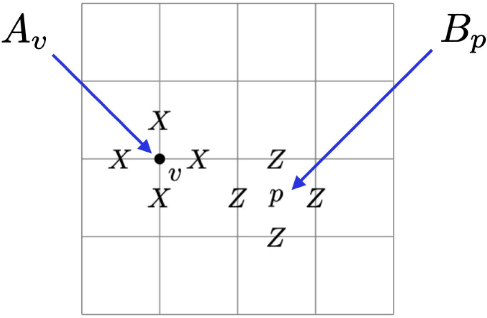

### Syndrome ancilla qubits

In princple, we would like to have an ancilla qubit for each star and for each plaquette appearing in the lattice. These ancilla qubits are initialized to the physical zero state $| 0 \rangle$, and flip to $| 1 \rangle$ if and only if the data qubits associated to the corresponding plaquette or star are in a $-1$ eigenstate for the respective plaquette or star operator. 

To do this, we can use a "Hadamard test" for each star or plaquette, which is a special case of the quantum phase estimation procedure. The circuit diagram for the Hadamard test circuit is depicted below:

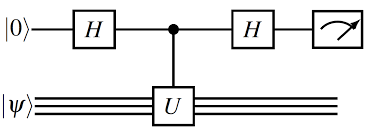

As with the quantum phase estimation algorithm, an eigenvector $| \Psi \rangle_{ n }$ of a unitary gate $U$ is prepared in the bottom register, and our ancilla qubit goes in the top register. In the case that $| \Psi \rangle_{n}$ is an eigenvector with eigenvalue $+1$ or $-1$ for $U$, running this circuit and measuring the ancilla qubit gives us the $+1$ if $| \Psi \rangle$ is an eigenvector with eigenvalue $-1$ and $0$ if it is an eigenvector with eigenvalue $1$.

In the context of star and plaquette operators, measuring corresponding ancilla qubits will deterministically give us a $1$ if the $4$ surrounding data qubits are in a $-1$ eigenstate and give a $0$ if the data qubits are in a $+1$ eigenstate. By performing these ancilla measurements for each star or plaquette, the syndrome qubits signal to us which star or plaquette contains an odd number of $X$ or $Z$ flipped data qubits. Note that this does not precisely pinpoint to us which qubits have been flipped, but instead it is a "hint" of what might be possible. 

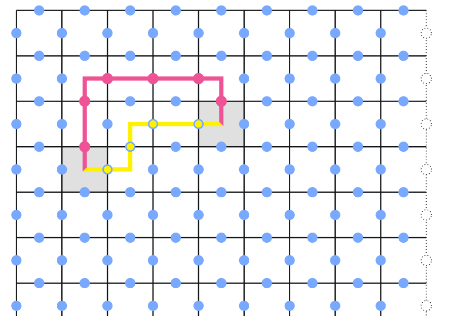

For example, depicted in the figure above are two plaquettes whose ancilla qubits measure to $+1$, signalling that the data qubits are in a $-1$ eigenstate for the corresponding plaquette operators associated to those plaquettes. No other plaquettes in this illustration have ancilla qubits measuring to $+1$ (they all measure to $0$). 

 Depicted in the figure are two alternative "explanations" for why those two plaquettes are the *only* plaquettes whose associated data qubits are in a $-1$ eigenstate. Both the pink path and yellow paths consist of qubits that have been $X$-flipped, so that the initial and terminal plaquettes of the paths are the ones whose associated data qubits are in a $-1$ eigenstate. As one might realize, there may be many possible paths of $X$-flips that can "explain" the syndrome measurement. In a perfect world, we would be able to pick out the correct path that actually caused the syndrome measurement, and reverse the $X$ flips that got us the syndrome measurements in the first place. 

 However, as far as addressing the syndrome measurements goes, one does not need to know exactly which path of $X$-flips caused the resulting syndrome measurement. Recall that contractible loops of $X$-flips ends up forming an element of the stabilizer group. Therefore, if we pick *any* path connecting the plaquettes marked with $-1$ syndrome measurements, such that path does not extend past the periodic boundary of the lattice, the (possibly unknown) $X$-flips causing the syndrome measurement, together with our chosen path of $X$-flips together form an element of stabilizer group which "cancels out" the effect of the original $X$-flip path on a logical state. In the illustration above, applying $X$-flips to all the qubits on the pink path and the yellow path results in an element of the stabilizer group, even if the yellow and pink paths are distinct.

## Reusing ancilla qubits in the implementation

In order to keep the number of required ancilla qubits lower, we rely on the fact that we can address $X$-errors and $Z$-errors independently from each other, and that there are as many stars as there are plaquettes in a lattice. In other words, we can first use $k^{2}$ many ancilla qubits to find the locations of $-1$ eigenstate stars, measure them onto a classical register then reset the ancilla qubits, address the syndromes based on reading a classical register, and then repeat the process for plaquettes. In the end, the decoding procedure will *deterministically* resolve syndrome measurements for both $X$ and $Z$ errors.   

## Logical errors and code distance

Unfortunately, things become more complicated when there are many physical errors at once. Recall that forming a *non-contractible* loop of $X$ or $Z$ flips has the affect of performing a logical $X$ or $Z$ operation. Therefore, if we correct many $X$ or $Z$ errors by choosing connecting paths for each pair of $-1$ measured stars or plaquettes in such a way that the connecting paths union to a non-contractible loop, we will resolve the syndrome measurement (in that the syndromes will measure to $0$ for every star and plaquette) while changing the logical state of the data qubits. This is a logical error, and this means that we cannot recover the logical state initially prepared at the start of the encoding. 

It is easy to see that the shortest path on the lattice which forms a non-contractible loop is of length $k$ (going across vertically or horizontally). Thus, the code distance for the toric code on a $k \times k$ lattice is $k$. In other words, for syndrome corrections to accumulate to a logical error, we need $X$ and $Z$ flips in the syndrome recovery procedure have to reach across the entire lattice. As a result, for sufficiently low error rates, it should be the case that increasing the lattice grid size gives us a lower expected rate of logical errors in our decoding. On the other hand, if the error rate is too high, then larger sizes of lattices will mean that there will be more qubits that may be flipped which will make it more likely that we make corrections that accumulate to a logical error. The bifurcation point of physical error rate leading to more logical errors as the code distance increases is the *code threshold* -- highly dependent on the error model and decoding algorithm used, and other implementation details. 

Running some preliminary simulations with this implementation estimates that the threshold, under our error model, seems to be somewhere near 6%  to 13$

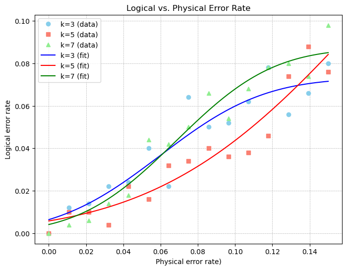

## Decoding with minimal weight perfect matchings

On one hand, while we can "resolve syndrome measurements" (i.e. affect the state of our data qubits so that syndrome measurements no longer measure $-1$-eigenvalues) by arbitrarily pairing up $-1$-eigenvalue stars and plaquettes, it would be especially prudent to choose these pairings more wisely. In light of the risk of inducing logical errors upon addressing syndrome measurements, it is of course beneficial to choose these pairings in a way that attempts to minimizes the probability of this occuring. 

To this end, there is a reasonable choice of pairing algorithm, given by minimum weight perfect matchings.
The idea here is to choose all of our pairings so that the total distance travelled between all paths connecting pairs of $-1$ eigenvalue stars or plaquettes is minimized. 

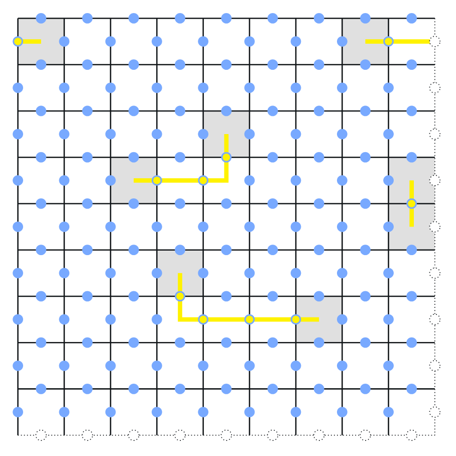

For a sufficiently small number of errors, minimizing the total distance between all paths connecting pairs of $-1$ eigenvalue stars or plaquettes will make it less likely for the syndrome recovery procedure to inadvertently cause a logical error.  

In this implementation, we measure syndrome qubits onto a classical register, and use the result of the measurement to form a NetworkX (complete) graph. The nodes of the graph are given by stars or plaquettes respectively (depending on if we are currently assessing star or plaquette syndromes), whose syndromes measured $-1$ eigenvalues. The edges of the graph are weighted by the distance between these stars or plaquettes. After initializing a weighted graph in NetworkX, NetworkX has an implementation of the blossom algorithm used to efficiently compute minimum weight perfecting matchings. 
