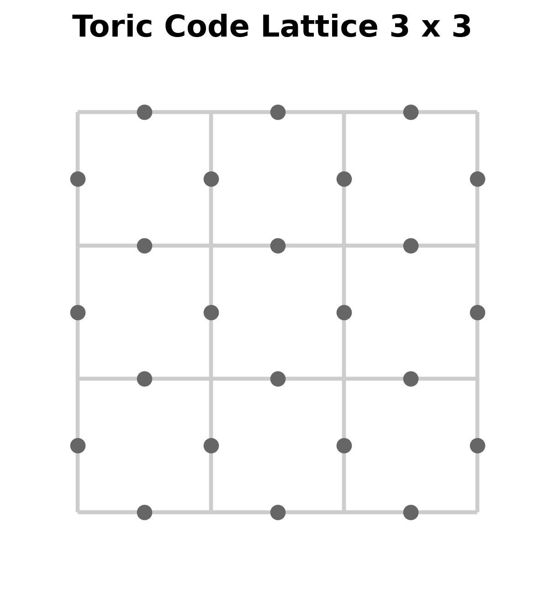
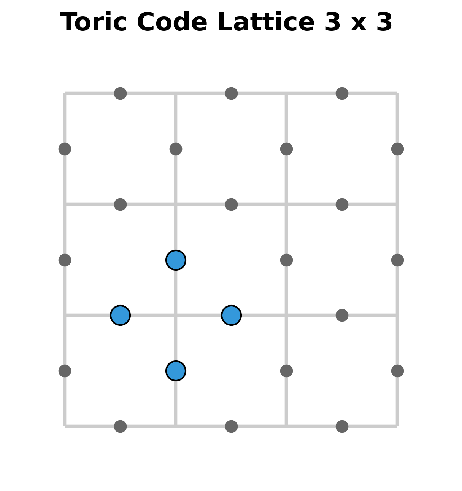
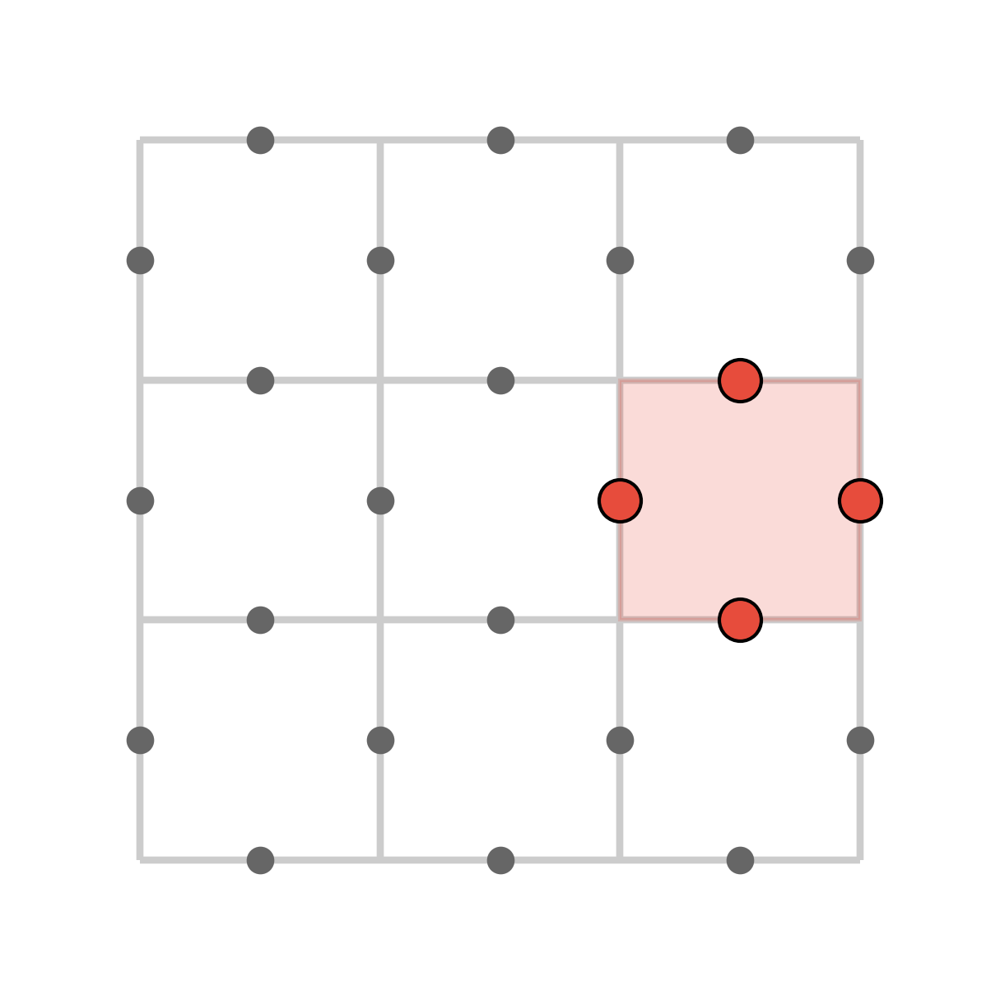

# Kitaev's toric code
A qiskit implementation of Kitaev's toric code

## Introduction

Kitaev's toric code is a quantum error correction code, modelled on a $k \times k$ toric lattice (i.e. with periodic boundary), using $2 k^{2}$ physical qubits to encode $2$ logical qubits. In other words, the Kitaev toric code is a $[[2 k^{2} , 2, k]]$ stabilizer code.

A novel feature of the toric code is that the stabilizer elements are defined with respect the spatial arrangement of qubits situated on a $k \times k$ toric lattice. For example, the below image is a $3 \times 3$ toric lattice: 

With respect to this lattice, the physical qubits are placed where the grey dots mark the edges. As the lattice represents a torus and has periodic boundary, the qubits on top and bottom rows are identified, as are the qubits on the left and right outer vertical columns. 
Note that with this arrangement, we have a total of $2 \cdot 3^{2} = 18$ (physical) qubits.  

The stabilizer group for the code is generated by certain operators associated to certain configurations of qubits on the lattice. These configurations are given by <em>stars</em> and <em>plaquettes</em>, as depicted below:

That is, stars are associated to vertices of the lattice, and are given by the respective collections of $4$ qubits on the edges which make up a "star" of a vertex. Plaquettes are associated to the square cells of the lattice, and are given by the the $4$ qubits along the boundary of such a square cell. 

To each star, we associate a unitary given by applying an $X$-gate to each physical qubit in the star. 
To each plaquette, we associate a unitary given by applying a $Z$-gate to each physical qubit in the plaquette. We may refer to these as "star operators" and "plaquette operators".

Then, the toric code is defined to be the stabilizer code generated by star and plaquette operators for each star and plaquette of a fixed toric lattice. One may easily verify that this indeed defines a stabilizer code -- in fact, it is a CSS code. 

Note that while there are $2 k^{2}$ physical qubits, there will be $2 \cdot (k^{2} - 1 )$ minimal  stabilizer generators (corresponding to $k^{2}$ many stars and plaquettes respectively, and accounting for a single relation among the star operators and a single relation among the plaquette operators). Thus, the toric code encodes $2k ^{2}  -   2 (k^{2} - 1) = 2$ logical qubits which we may write as $| x_{0} x_{1} \rangle_{L}$.

This repository contains an implementation of the Kitaev toric code in qiskit. While the implementation may not be state of the art in its efficiency or optimal in any technical sense, the "down to earth" python/qiskit implementation may prove to be useful for educational purposes. 

## Some details on the implementation

Apart from qiskit, [the main code](KitaevToricCode.py) uses [NetworkX](https://networkx.org/), a package which supplies useful implementations of graphs and networks in python. In particular, NetworkX has an implementation of the "blossom algorithm" which generates minimal weight perfect matchings of a graph with an even number of nodes. This is important for the decoding step of the toric code.

The main body of code is contained in the file [KitaevToricCode.py](KitaevToricCode.py). It contains a python/qiskit function that takes the following inputs: 

1. A pair of booleans $(x_{0}, x_{1}) \in \mathbb{F}^{n}_2$
2. An integer $k$ 
3. An error probability, $p$

and outputs a quantum circuit that does the following:

1. Prepares the logical state $| x_0 x_1 \rangle_L$ with respect to the toric code of size $k$ (i.e. on $2k^{2}$ physical data qubits)
2. Runs it through a random Pauli error channel with error rate $p$
3. Applies appropriate syndrome measurement procedures, along with corresponding syndrome decoding procedures if necessary
4. Measures the data qubits with respect to the appropriate logical $Z$-operators

Note that in the end, we measure the data qubits with respect to the logical $Z$-operators, and not
with respect to the standard computational basis (i.e. with respect to physical Pauli $Z$-operators). 

The idea here is that the $4$ logical basis states $|00\rangle_L$, $|01\rangle_L$, $|10\rangle_L$ and
$|11\rangle_L$ are not necessarily eigenvectors with respect to physical Pauli Z operators, but they are instead eigenvectors with respect to logical $Z$-operators with corresponding eigenvalue measurements:

 Logical State   | $(Z_0)_L$ | $(Z_1)_L$
 --------        | -------   |   ------- 
 $\|00 \rangle_L$  | $1$       | $1$               
 $\|01 \rangle_L$  | $1$       | $-1$              
 $\|10 \rangle_L$  | $-1$      | $1$              
 $\|11 \rangle_L$  | $-1$      | $-1$              

Thus, assuming that the "recovery process" of the error correction procedure leaves us with a logical state in the end, we may use $2$ ancilla qubits corresponding to $(Z_0)_L$ and $(Z_1)_L$, 
whose states will be determined and distinguished by the different configurations of eigenvalues we may have (as described by the above table). By measuring these ancilla qubits, we may recover (with some probability) the appropriate logical state as prepared in the beginning, even after the data qubits have been passed through a random Pauli channel.

## Encoding logical states in the toric code

As the star and plaquette operators are involutions and commute, they are simutaneously diagonalizable with eigenvalues $+1$ and $-1$. The logical $0$ state $| 0 \rangle_L$ can be prepared by projecting the $2k^{2}$ qubit $0$ state $| 0 0 0 \cdots 0 \rangle$ onto the simutaneous $+1$-eigenspace for each star and plaquette operator associated to the $k \times k$ lattice.

Following an idea from [this reference](https://pennylane.ai/qml/demos/tutorial_toric_code), we may prepare the appropriate logical zero (or  "ground state") by applying, for each star and plaquette, a circuit that prepares a "generalized GHZ state" among the qubits in the star or plaquette. 

For example, if we label the qubits on the star depicted below in a counterclock wise fashion: $q_0$, $q_1$, $q_2$, $q_3$   

then the GHZ state for this star is given by 

$$
q_0 \otimes q_1 \otimes  q_3 \otimes  q_4  = \frac{1}{\sqrt{2}} ( | 00 0 0 \rangle + | 1 1 1 1 \rangle )$$
$$

